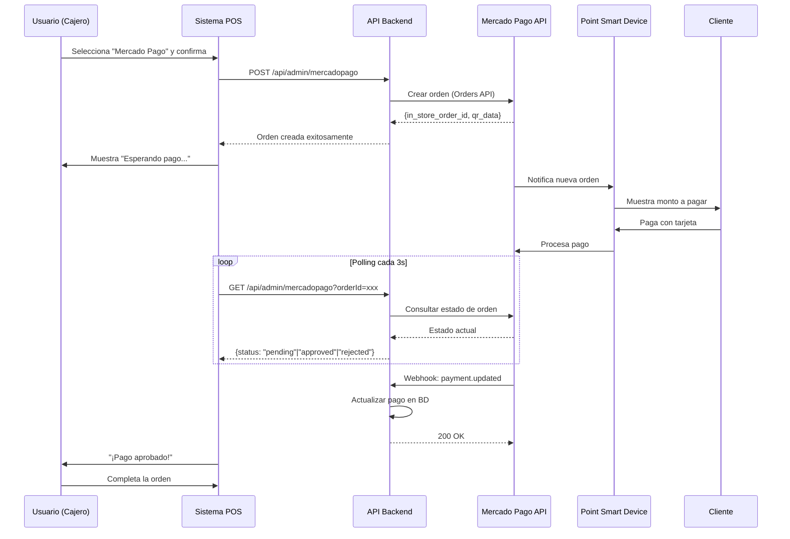

# 💳 Integración de Mercado Pago Point Smart con VipCleaners POS

## 📋 Descripción General

Esta guía documenta la integración completa de **Mercado Pago Point Smart** con el sistema de punto de venta (POS) de VipCleaners. La integración permite cobrar órdenes directamente a través del dispositivo Point Smart usando la moderna **Orders API** de Mercado Pago.

## 🎯 Características Implementadas

✅ **Flujo de pago automático** - La orden se envía directamente al Point Smart
✅ **Monitoreo en tiempo real** - Polling del estado del pago cada 3 segundos
✅ **Webhooks** - Notificaciones automáticas de cambios de estado
✅ **UI intuitiva** - Indicador visual del progreso del pago
✅ **Manejo de errores** - Reintentos automáticos y mensajes claros
✅ **Reconciliación automática** - El pago se registra automáticamente en la BD

---

## 🚀 Instalación y Configuración

### 1. Obtener Credenciales de Mercado Pago

1. Ve al [Panel de Desarrolladores de Mercado Pago](https://www.mercadopago.com.mx/developers/panel)
2. Crea una aplicación o selecciona una existente
3. En la sección de credenciales, copia:
   - **Access Token** (Production o Test según tu entorno)
   - **User ID** (también llamado Collector ID)

### 2. Configurar el Point Smart

1. Inicia sesión en tu cuenta de Mercado Pago
2. Ve a **Cobrar → Puntos de venta**
3. Configura tu tienda y punto de venta:
   - **External Store ID**: Identificador único de tu tienda (ej: `vipcleaners_store`)
   - **External POS ID**: Identificador del punto de venta (ej: `vipcleaners_pos_01`)
4. Vincula tu dispositivo Point Smart al punto de venta configurado

### 3. Configurar Variables de Entorno

Edita el archivo `.env` y agrega las siguientes variables:

```bash
# Mercado Pago Point Smart Integration
MERCADOPAGO_ACCESS_TOKEN=tu_access_token_aqui
MERCADOPAGO_USER_ID=tu_user_id_aqui
MERCADOPAGO_EXTERNAL_STORE_ID=vipcleaners_store
MERCADOPAGO_EXTERNAL_POS_ID=vipcleaners_pos_01

# URL base para webhooks
NEXT_PUBLIC_BASE_URL=https://tudominio.com  # En producción
```

**⚠️ IMPORTANTE**: Nunca compartas tus credenciales. El archivo `.env` ya está en `.gitignore`.

### 4. Configurar Webhooks (Producción)

Para recibir notificaciones de cambios de estado:

1. Ve a tu aplicación en el panel de Mercado Pago
2. Navega a **Webhooks**
3. Agrega la siguiente URL de notificaciones:
   ```
   https://tudominio.com/api/webhooks/mercadopago
   ```
4. Selecciona los eventos:
   - ✅ `payment.created`
   - ✅ `payment.updated`

---

## 📁 Archivos de la Integración

### Backend (API Routes)

1. **`/app/api/admin/mercadopago/route.ts`**
   - Endpoint principal para crear y consultar órdenes en Mercado Pago
   - **POST**: Crea una orden de pago en Point Smart
   - **GET**: Consulta el estado de una orden existente

2. **`/app/api/webhooks/mercadopago/route.ts`**
   - Recibe notificaciones de Mercado Pago
   - Actualiza el estado del pago en la base de datos
   - Registra pagos aprobados automáticamente

### Frontend (Componentes)

3. **`/components/admin/pos/EnhancedPaymentModal.tsx`**
   - Modal de pago mejorado con soporte para Point Smart
   - Maneja el flujo de pago según el método seleccionado
   - Integra el componente de estado de pago

4. **`/components/admin/pos/PointPaymentStatus.tsx`**
   - Componente visual que muestra el estado del pago en tiempo real
   - Realiza polling del estado cada 3 segundos
   - Muestra mensajes de éxito, error o cancelación

### Configuración

5. **`.env.example`**
   - Plantilla de variables de entorno necesarias

---

## 🔄 Flujo de Pago Completo



---

## 🛠️ Uso en el POS

### Para el Cajero:

1. **Agregar productos/servicios al carrito**
2. **Seleccionar cliente**
3. **Presionar "Procesar Pago"**
4. **Seleccionar método "Mercado Pago"**
5. **Confirmar el pago**
6. **El sistema mostrará**:
   - ✅ Spinner de "Esperando pago en Point Smart..."
   - ✅ Monto a cobrar
   - ✅ Tiempo transcurrido
   - ✅ Estado de conexión con Point

7. **El cliente paga en el Point Smart**
8. **El sistema detecta automáticamente el pago aprobado**
9. **La orden se completa automáticamente**

### Indicadores de Estado

| Estado | Icono | Descripción |
|--------|-------|-------------|
| Pendiente | 🔵 Spinner azul | Esperando que el cliente pague |
| Procesando | 🔄 Girando | Cliente está pagando en Point |
| Aprobado | ✅ Check verde | Pago exitoso |
| Rechazado | ❌ X roja | Pago rechazado por el banco |
| Cancelado | ⚠️ Alerta naranja | Pago cancelado |
| Error | 🔴 Error | Error de comunicación |

---

## 🧪 Testing

### Modo Sandbox (Desarrollo)

1. Usa tus credenciales de **Test** de Mercado Pago
2. Configura `NEXT_PUBLIC_BASE_URL=http://localhost:3001`
3. Usa tarjetas de prueba de Mercado Pago:

```
Tarjeta de crédito aprobada:
Número: 5031 7557 3453 0604
CVV: 123
Fecha: 11/25
Nombre: APRO

Tarjeta rechazada:
Número: 5031 7557 3453 0604
Nombre: OTHE (otros motivos)
```

### Verificar Integración

1. **Verificar webhook está activo**:
   ```bash
   curl https://tudominio.com/api/webhooks/mercadopago
   ```
   Debería devolver: `{"status": "active"}`

2. **Verificar configuración de MP**:
   - Las credenciales están configuradas en `.env`
   - El Point Smart está encendido y conectado
   - El POS ID coincide con la configuración en Mercado Pago

---

## 🐛 Solución de Problemas

### Error: "Configuración de Mercado Pago incompleta"

**Causa**: Faltan credenciales en `.env`

**Solución**:
```bash
# Verifica que estas variables existan y tengan valores:
echo $MERCADOPAGO_ACCESS_TOKEN
echo $MERCADOPAGO_USER_ID
```

### Error: "Point Smart no muestra la orden"

**Posibles causas**:

1. **Point no está vinculado al POS correcto**
   - Verifica en Mercado Pago que el `MERCADOPAGO_EXTERNAL_POS_ID` coincida

2. **Point no tiene conexión**
   - Verifica que el dispositivo tenga WiFi o datos móviles

3. **Configuración incorrecta del Store/POS**
   - Revisa que los IDs en `.env` coincidan con los de Mercado Pago

### Error: "Tiempo de espera excedido"

**Causa**: El pago no se completó en 5 minutos

**Solución**:
- Presiona "Reintentar" para verificar nuevamente el estado
- O cancela y usa otro método de pago
- Verifica manualmente en Mercado Pago si el pago se procesó

### Webhook no recibe notificaciones

**Solución**:

1. Verifica que la URL del webhook esté configurada correctamente
2. Asegúrate de que tu servidor sea accesible públicamente (no localhost)
3. Revisa los logs del webhook en Mercado Pago:
   ```
   Panel → Tu aplicación → Webhooks → Logs
   ```

---

## 📊 Base de Datos

### Tabla `pagos`

La tabla de pagos se actualiza automáticamente cuando se recibe un webhook:

```sql
-- Campos relevantes para Mercado Pago:
metodo_pago = 'mercado_pago'  -- o el tipo específico de tarjeta
referencia_pago = '{payment_id}'  -- ID del pago en Mercado Pago
estado_pago = 'completado'  -- o 'rechazado'
fecha_pago = NOW()
```

---

## 🔐 Seguridad

### Buenas Prácticas Implementadas

✅ **Autenticación requerida** - Solo admins pueden usar la API
✅ **Validación de datos** - Todos los inputs son validados
✅ **Credenciales seguras** - Access tokens en variables de entorno
✅ **HTTPS requerido** - Para webhooks en producción
✅ **Logs detallados** - Para auditoría y debugging

### Recomendaciones Adicionales

1. **Rotar el Access Token periódicamente** (cada 6 meses)
2. **Monitorear webhooks** para detectar intentos de fraude
3. **Usar HTTPS** en producción (requerido por Mercado Pago)
4. **Mantener credenciales fuera del código** (usar `.env`)

---

## 📚 Referencias

- [Documentación oficial de Mercado Pago Point](https://omega.mercadopago.com.mx/developers/es/docs/mp-point/integration-configuration/integrate-with-pdv/introduction)
- [Orders API Documentation](https://www.mercadopago.com.mx/developers/es/news/2025/07/16/Transform-your-point-of-sale-with-the-new-integration-between-Point-and-the-Orders-API)
- [API Reference](https://www.mercadopago.com.mx/developers/en/reference)
- [Webhooks Guide](https://www.mercadopago.com.mx/developers/es/docs/your-integrations/notifications/webhooks)

---

## 💡 Próximas Mejoras

- [ ] Soporte para múltiples dispositivos Point
- [ ] Reportes de transacciones de Mercado Pago
- [ ] Cancelación de órdenes desde el POS
- [ ] Reembolsos parciales/totales
- [ ] Impresión de recibo desde Point Smart
- [ ] Integración con QR estático de Mercado Pago

---

## 📞 Soporte

Si tienes problemas con la integración:

1. **Consulta los logs del servidor**: `console.log` en `/api/admin/mercadopago`
2. **Revisa logs de Mercado Pago**: Panel → Webhooks → Logs
3. **Contacta soporte de Mercado Pago**: https://www.mercadopago.com.mx/ayuda

---

**Última actualización**: 2025-11-24
**Versión de la integración**: 1.0.0
